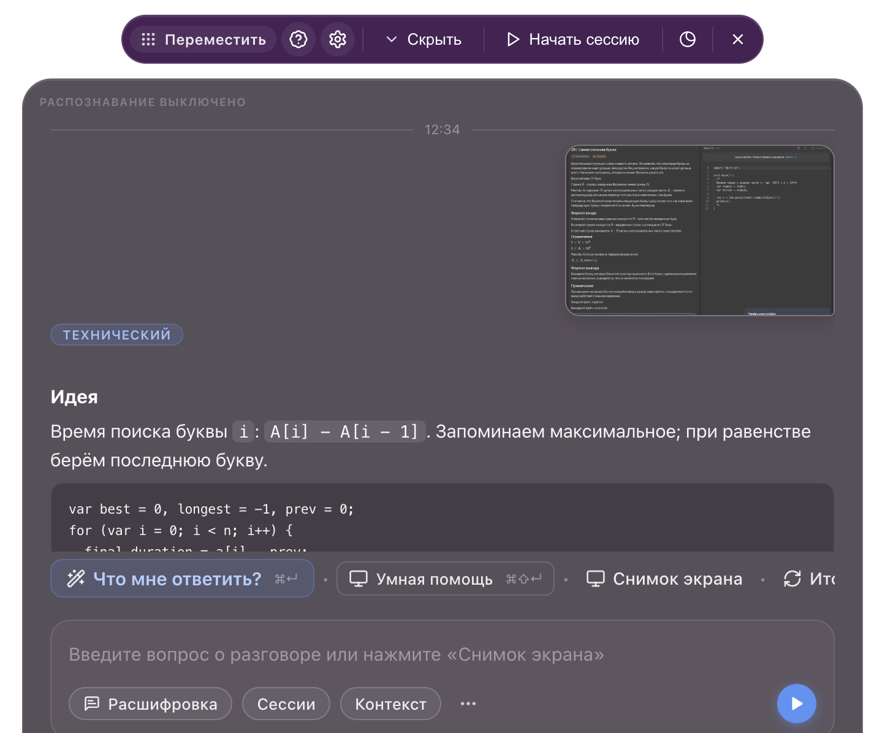
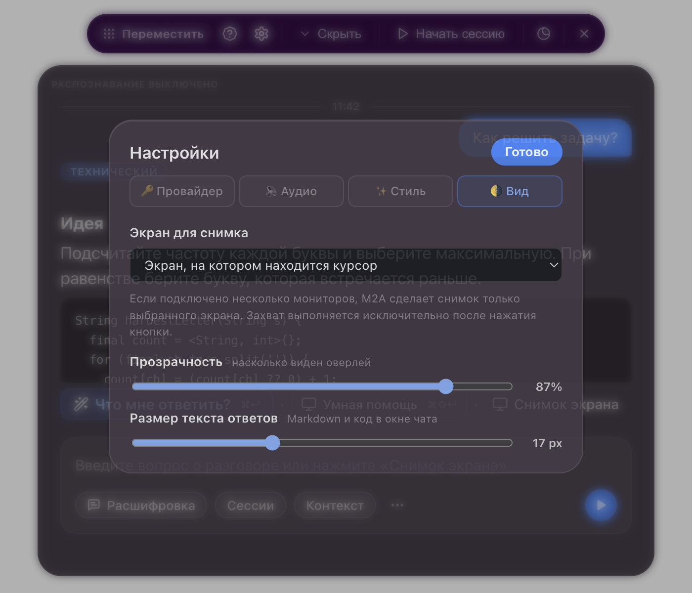

<div align="center">

# M2A — Meeting AI Assistant

**Открытый русскоязычный AI-помощник для встреч, собеседований и разбора информации на экране.**

Работает через подписку Codex или Claude Code, API OpenAI/Anthropic либо собственный OpenAI-совместимый сервер. Распознавание речи настраивается независимо от провайдера чата.



</div>

---

> [!IMPORTANT]
> M2A предназначен для личных заметок, обучения, доступности, подготовки и разрешённой помощи во время встреч. Скрытие окна из записи и трансляции работает в режиме best effort и зависит от операционной системы и программы захвата. Соблюдайте правила экзамена, собеседования или конференции и требования к согласию участников записи.

## Пример: решить задачу со снимка экрана

1. Откройте задачу в браузере или IDE.
2. В **Настройки → Вид** выберите нужный монитор. Можно оставить вариант «Экран, на котором находится курсор».
3. Нажмите **Снимок экрана** или сочетание `⌘H` на macOS / `Ctrl+H` на Windows.
4. M2A сделает один снимок выбранного экрана, покажет его миниатюру в сообщении и отправит изображение выбранной модели.
5. Ответ появится в Markdown: краткая идея, код и оценка сложности.

Пример для задачи **«Самая сложная буква»**:

```dart
String hardestLetter(String s, List<int> typedAt) {
  var answerIndex = 0;
  var longest = -1;
  var previousTime = 0;

  for (var i = 0; i < s.length; i++) {
    final duration = typedAt[i] - previousTime;
    if (duration >= longest) {
      longest = duration;
      answerIndex = i;
    }
    previousTime = typedAt[i];
  }
  return s[answerIndex];
}
```

Время поиска `i`-й буквы равно `A[i] - A[i - 1]`, а для первой буквы — `A[0]`. Проход выполняется за `O(n)` и требует `O(1)` дополнительной памяти. Сравнение `>=` выбирает последнюю букву при равном времени поиска.

## Возможности

| Возможность | Как запустить | Что используется |
|---|---|---|
| **Что мне ответить?** | `⌘Enter` / `Ctrl+Enter` | выбранные реплики текущей встречи |
| **Умная помощь** | `⌘Shift+Enter` / `Ctrl+Shift+Enter` | вопрос и выбранная расшифровка |
| **Снимок экрана** | кнопка или `⌘H` / `Ctrl+H` | один снимок выбранного монитора |
| **Итоги** | кнопка «Итоги» | расшифровка текущей сессии |
| **Обычный вопрос** | текст и Enter | вопрос, контекст сессии и выбранные реплики |
| **Умный режим** | переключатель в поле ввода | более сильная модель выбранного провайдера |

Дополнительно:

- потоковый Markdown с удобными блоками кода;
- кнопка остановки ответа;
- новый запрос прерывает предыдущую генерацию;
- отдельный выбор провайдера чата и распознавания речи;
- ручное включение и исключение блоков расшифровки из контекста;
- файлы, ссылки, заметки и примеры внутри конкретной сессии;
- сохранение и продолжение предыдущих встреч;
- выбор монитора для снимка;
- изменение прозрачности, размера текста и размера самого окна;
- локальное распознавание через `whisper.cpp`.

<div align="center">
  
</div>

## Поддерживаемые провайдеры

### Чат и анализ экрана

| Вариант | Авторизация | Комментарий |
|---|---|---|
| **Codex** | существующий вход в Codex CLI | использует лимиты вашей подписки, API-ключ не нужен |
| **Claude Code** | существующий вход в Claude Code CLI | использует лимиты вашей подписки, API-ключ не нужен |
| **OpenAI API** | отдельный API-ключ | оплачивается через API-биллинг OpenAI |
| **Claude API** | отдельный API-ключ Anthropic | оплачивается через API-биллинг Anthropic |
| **Свой сервер** | URL, модель и необязательный ключ | любой OpenAI-совместимый endpoint |

Подписка ChatGPT/Codex и API OpenAI имеют разные биллинги. В режиме Codex приложение запускает установленный CLI и использует его авторизацию; в режиме OpenAI API расходуется баланс API.

### Распознавание речи

Распознавание выбирается независимо от чата:

- **Локальный Whisper** — аудио остаётся на компьютере;
- **OpenAI API** — отдельный ключ для распознавания;
- **Свой сервер** — OpenAI-совместимый speech-to-text endpoint.

Для русской речи по умолчанию выбраны язык `ru` и многоязычная модель `large-v3`. Модель можно заменить на меньшую, если важнее скорость или экономия памяти.

## Установка

### Готовая сборка

Откройте страницу [Releases](../../releases) и скачайте файл для своей системы:

- Windows x64: установщик `M2A - Meeting AI Assistant-win-x64.exe`;
- macOS Apple Silicon: архив `M2A - Meeting AI Assistant-…-mac-arm64.zip`;
- macOS Intel: архив `M2A - Meeting AI Assistant-…-mac-x64.zip`.

На macOS распакуйте приложение и перенесите его в `/Applications`.

### Запуск из исходников

Нужен Node.js 22.12 или новее.

```bash
git clone git@github.com:deorditse/Meeting-AI-Assistant.git
cd Meeting-AI-Assistant
npm install
npm run dev
```

`npm run dev` запускает Vite и Electron с горячим обновлением. Для запуска production-подобной локальной версии:

```bash
npm start
```

Сборка приложения:

```bash
npm run pack          # распакованная сборка текущей платформы
npm run dist:mac      # macOS x64 + arm64
npm run dist:win      # Windows x64 installer
npm run dist:linux    # Linux x64 AppImage
```

## Первый запуск

### 1. Разрешения

На macOS откройте **Системные настройки → Конфиденциальность и безопасность** и разрешите M2A:

- доступ к микрофону;
- запись экрана и системного звука.

После первого изменения разрешения macOS может потребовать перезапуск приложения. При ошибке M2A открывает нужный раздел системных настроек.

На Windows разрешите микрофон в **Параметры → Конфиденциальность и безопасность → Микрофон**. Для обычного снимка экрана отдельное разрешение не требуется.

### 2. Провайдер чата

Откройте **Настройки → Провайдер** и выберите Codex, Claude Code, OpenAI API, Claude API или свой сервер. Для подписочных вариантов приложение покажет состояние входа установленного CLI.

### 3. Распознавание речи

Откройте **Настройки → Аудио**. Для локального режима:

1. нажмите **Подготовить движок**, если `whisper.cpp` ещё не установлен;
2. выберите модель;
3. скачайте или импортируйте файл модели;
4. дождитесь статуса готовности.

Загрузка поддерживает отмену и продолжение, а файл проверяется по размеру и SHA-256. Локальный режим не переключается на облако автоматически при ошибке.

## Сессии и контекст

Кнопка **Контекст** относится только к текущей сессии. В неё можно добавить:

- тему и цель встречи;
- инструкции и примеры;
- PDF, DOCX, TXT, Markdown, CSV, JSON и HTML;
- ссылки на текстовые страницы.

Материалы сохраняются локально вместе с текущей сессией и восстанавливаются при её продолжении. Вместе с ними M2A восстанавливает провайдера, модель, режим Smart и системные инструкции. API-ключи в историю сессий не записываются. Один файл ограничен 20 МБ, а текст перед отправкой дополнительно сокращается до безопасного размера контекста.

Каждая распознанная реплика по умолчанию подсвечена и входит в запрос к AI. Нажмите на блок расшифровки, чтобы исключить его; повторное нажатие вернёт его в контекст.

Завершённые встречи доступны через кнопку **Сессии**. Сохранённую сессию можно открыть и продолжить: её расшифровка снова становится активной для новых вопросов и итогов.

## Управление

| Действие | macOS | Windows/Linux |
|---|---|---|
| Отправить вопрос | `Enter` | `Enter` |
| Перенос строки | `Shift+Enter` | `Shift+Enter` |
| Что мне ответить? | `⌘Enter` | `Ctrl+Enter` |
| Умная помощь | `⌘Shift+Enter` | `Ctrl+Shift+Enter` |
| Снимок экрана | `⌘H` | `Ctrl+H` |
| Настройки | `⌘,` | `Ctrl+,` |
| Выход | `⌘Shift+X` | `Ctrl+Shift+X` |

Окно перемещается за верхнюю плашку. Размер меняется перетаскиванием любого края или угла и сохраняется между запусками. Пустые прозрачные области пропускают клики в приложение под M2A.

## Как устроен проект

M2A — Electron-приложение с renderer на React 18, TypeScript и Vite.

```text
main.js                         composition root Electron
src/domain/                     чистые правила и преобразования
src/application/                сценарии приложения и состояние use case
src/infrastructure/electron/    IPC и адаптеры Electron
frontend/src/features/          независимые функции интерфейса
frontend/src/pages/             сборка экрана ассистента
```

Экран, микрофон и системный звук обрабатываются раздельно:

```text
выбранный экран ── снимок по кнопке ───────────────┐
микрофон ──────── VAD → распознавание → «Вы» ─────┼─ контекст → выбранная LLM → Markdown
системный звук ── VAD → распознавание → «Собеседник»┘
```

Подробности находятся в [описании архитектуры](docs/ARCHITECTURE.md), а результаты последнего аудита и порядок дальнейшего рефакторинга — в [ARCHITECTURE_AUDIT.md](docs/ARCHITECTURE_AUDIT.md).

## Приватность

- Снимок создаётся только после явного нажатия кнопки или горячей клавиши.
- Локальный Whisper не отправляет аудио в облако.
- Контекст сессии не сохраняется в глобальных настройках.
- Ключи и история встреч хранятся локально в каталоге данных Electron.
- В облако уходит только запрос, необходимый выбранному провайдеру для ответа или распознавания.
- Окно запрашивает у ОС исключение из захвата через `setContentProtection(true)`, но результат зависит от платформы и программы трансляции.

## Решение проблем

### «Движок Whisper не подготовлен»

В packaged-сборке откройте **Настройки → Аудио** и нажмите **Подготовить движок**. При запуске из исходников можно подготовить runtime командой:

```bash
npm run prepare:whisper
```

На macOS для локальной сборки `whisper.cpp` нужны CMake и Xcode Command Line Tools.

### «Модель Whisper не найдена»

Выберите модель в **Настройки → Аудио** и нажмите **Скачать**. Если проверка файла не проходит, удалите модель в том же разделе и загрузите заново.

### Разрешение на запись экрана уже включено, но M2A его не видит

На macOS выключите и снова включите M2A в разделе записи экрана, затем полностью завершите и откройте приложение. После пересборки подпись локального приложения может измениться, и macOS воспринимает его как новую версию.

### Codex CLI сообщает `workspace routing discovery failed`

Проверьте вход командой `codex login`, доступность сети и работу обычного запроса через CLI. M2A повторяет временные routing-ошибки, но не может восстановить недоступную авторизацию или сервис.

### В расшифровке появляются «Спасибо» и «Продолжение следует»

Используйте многоязычную модель `large-v3`, язык `ru` и уменьшите фоновый шум. M2A фильтрует известные артефакты тишины, но слишком короткие или тихие фрагменты всё равно снижают точность.

## Проверки

```bash
npm test
npm run build
npm audit --omit=dev
```

## Лицензия

[GPL-3.0-or-later](LICENSE)
